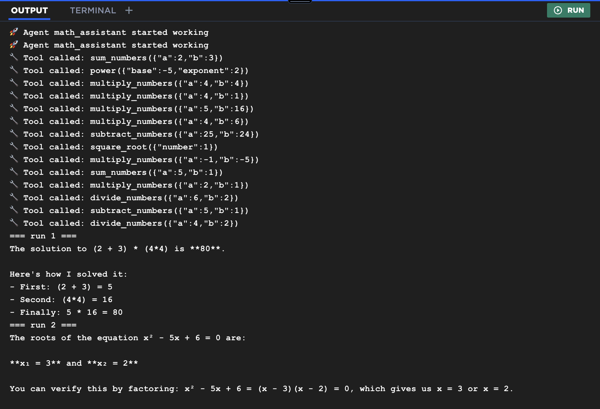
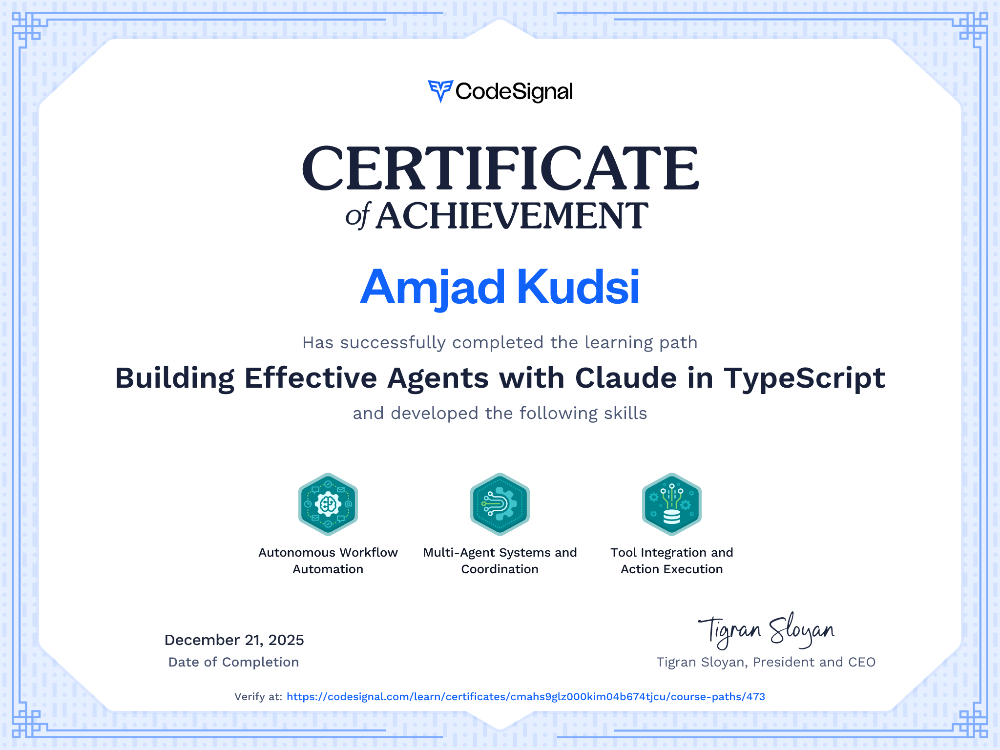

# Anthropic-Claude-Agents
Build effective Claude agents from scratch using pure TypeScript and direct Anthropic API calls. Master LLM workflows, tool integration, autonomous agent patterns, multi-agent orchestration, and async parallelization, all without any frameworks.

# Parallel Agents Implementation - Math Assistant

# Completion Certificate

